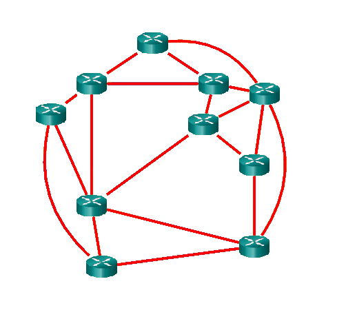
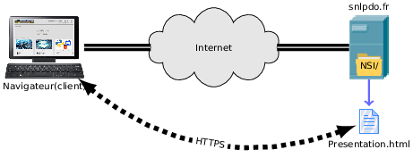

# Chapitre 0. Généralités

Le Web est un maille de ressources réseau basé sur la notion d'*hypertexte numérique* (1965).

|  |  |
| -------------------------------- | ---------------------------------------------- |

Le Web résulte d'un projet mené au début des années 1990 par le britannique Tim Berners Lee et le belge R. Caillau, alors qu'ils travaillaient pour le CERN.

Ils ont créé l'URL, le langage HTML et le protocole HTTP pour gérer la documentation du CERN et pour faciliter la collaboration des employés via le réseau (initialement ARPANET puis Internet).

Tim Berners Lee est devenu en 1994 le président du consortium international W3C qui s'occupe de promouvoir les technologies du Web.

## 0.1. URL

(*Uniform Resource Locator*)

Elle indique à la fois l'emplacement d'une ressource et la façon d'y accéder. Son format est le suivant:

`<protocole>://<serveur>/<chemin vers ressource>`

Exemple:

1. Protocole d'accès: `http` (existe aussi `https`, `file` ...)

2. Lieu de stockage (serveur): `snlpdo.fr` (nom de machine ou adresse IP, Cf DNS)

3. Emplacement de la ressource (chemin **hiérarchique**): `NSI/presentation.html`
   
   - Répertoire: `NSI/`
   - Fichier: `presentation.html`

