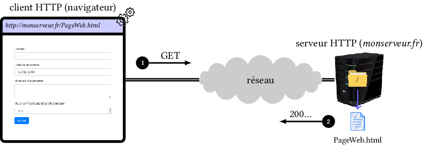

# Chapitre 1. HTTP

## 1.1 Application client/serveur

HTTP est un protocole (de la couche application) utilisé pour les communications entre clients et serveurs Web:



> Cas où l'utilisateur tape l'URL `http://monserveur.fr/PageWeb.html` dans son navigateur:
> 
> 1. Le client HTTP effectue une requête `GET` auprès du serveur (`monserveur.fr`) pour obtenir le fichier `PageWeb.html`.
>    Par exemple:
>    
>    ```http
>    GET /PageWeb.html HTTP/1.1
>    Host: monserveur.fr
>    ```
> 
> 2. Comme le fichier (`PageWeb.html`) existe, le serveur renvoie le code de retour `200` [^1] puis le contenu HTML.
>    Par exemple:
>    
>    ```http
>    HTTP /1.1 200 OK
>    Date: 
>    ```
>    
>    Le code HTML et ses ressources sont ensuite interprétés par le navigateur afin de réaliser un affichage (celui-ci peut différer d'un navigateur à un autre).

[^1]: `30x` en cas de redirection, `404` si la ressource n'existe pas, `50x` en cas d'erreur sur le serveur&hellip;

HTTP permet la communication entre 2 systèmes informatiques à l'aide d'une connexion TCP:

- Le numéro de port du serveur est traditionnellement 80 mais il peut être, bien évidemment, modifié. 

- Le service demandé est localisé par une *URL*.

Les requêtes et réponses utilisent le codage ASCII mais l'échange de contenu peut se faire selon un autre codage, voire en binaire. Les principales méthodes de requêtes sont:

- `GET`

- `POST`

- `HEAD`, `PUT`, `DELETE`, `OPTIONS`, `CONNECT`...

## 1.2. Méthode GET

La requête se trouve dans l'URL sous la forme d'une chaîne de caractères.

`http://localhost:7001/index.html`

Exemples de requêtes:

- 1ère version de l'HTTP (rétrospectivement appelée 0.9):

```http
GET /index.html
```

- HTTP version 1.0:

```http
GET /index.html HTTP/1.0
```

- HTTP version 1.1:

```http
GET /index.html HTTP/1.1
Host: localhost:7001
User-Agent: Mozilla/5.0 (X11; Linux x86_64; rv:21.0) Gecko/20100101 Firefox/21.0
Accept: text/html,application/xhtml+xml,application/xml;q=0.9,*/*;q=0.8
Accept-Language: fr,fr-fr;q=0.8,en-us;q=0.5,en;q=0.3
Accept-Encoding: gzip, deflate
```

Le serveur répond ensuite par `200 OK` ou un code d'erreur (`400`, `404`, ...) puis, si c'est le cas, la ressource demandée:

```http
HTTP/1.1 200 OK
Date: Sun, 23 Jun 2013 20:07:53 GMT
Server: Apache/2.4.4 (Fedora) PHP/5.4.16
Last-Modified: Sun, 23 Jun 2013 15:30:08 GMT
ETag: "c7-4dfd3f8973872"
Accept-Ranges: bytes
Content-Length: 199
Content-Type: text/html; charset=UTF-8

<!DOCTYPE htm;>
<html>
...
```

Dans le cas d'un formulaire Web, les données sont ajoutées automatiquement à la fin de l'URL d'appel de la *servlet* :

- Les données débutent après le caractère `?` ,

- Chaque donnée est écrite en ASCII selon le format `name=value`

- 2 données successives sont séparées par le caractère `&`.

```http
GET /servlet?name1=value1&name2=value2 HTTP/1.1
Host: monserveur.fr
```

Les données sont automatiquement extraites par le serveur HTTP et fournies à la servlet via la variable d'environnement `QUERY_STRING` lors de son lancement.

Propriétés des requêtes `GET`:

- elles peuvent être mises en cache,

- elles sont conservées dans l'historique du navigateur,

- elles peuvent être enregistrées en favoris,

- elles sont limitées en longueur (l'URL est limitée à 2048 caractères),

- elles sont directement lisibles dans l'URL (pas de confidentialité).

## 1.3. Méthode POST

Cette méthode est essentiellement utilisée pour envoyer des données de formulaire Web au serveur HTTP: elles sont fournies en tant que *données supplémentaires* lors de l'appel de la servlet.

```http
POST /test/index.php HTTP/1.1
Host: localhost
name1=value1&name2=value2
```
