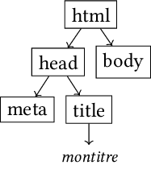
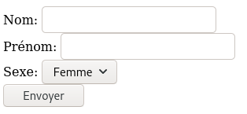
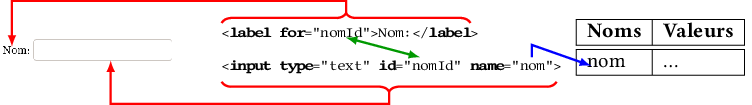
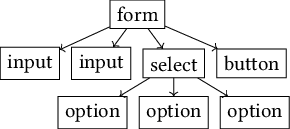
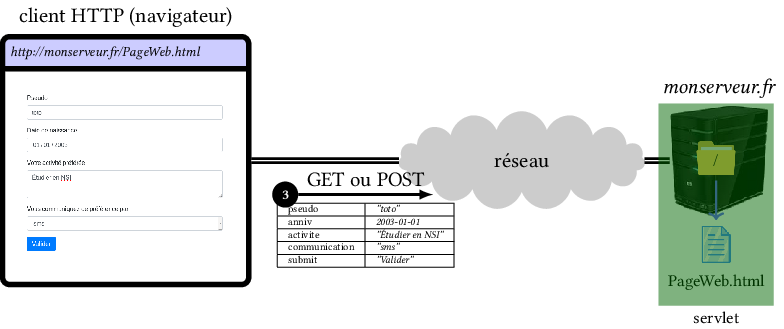

# Chapitre 2. HTML 5

(*HyperText Markup Language*=langage à balisage hypertexte)

> Après s'être fortement rapproché de l'XML jusqu'aux version 4.x, le HTML s'en en ré-éloigné depuis la version 5. 

Ce langage est utilisé pour représenter des documents (pages) qui se trouvent sur le Web. Il permet de décrire le contenu et la structure d'un document multimédia (texte, image, son, hyperliens...) à l'aide de containers sémantiques (les balises). 

Un fichier HTML (version 5) débute par la ligne suivante:

```html
<!DOCTYPE html>
```

> Attention: bien que subsistent quelques balises ou attributs HTML capables d'influer sur la présentation du document, il est désormais préférable de gérer exclusivement l'apparence du document à l'aide de styles CSS.

## 2.1. Structure d'un document

Un document HTML est constitué d'**éléments HTML** selon le format:

`<nomDeBalise attribut1="valeur1">contenu</nomDeBalise>`

- Un élément commence toujours par une balise ouvrante (`<nomDeBalise>`) et se termine *souvent* par une balise fermante (`</nomDeBalise>`).

- Certains éléments ne sont constitués que d'une balise ouvrante (ou parle alors de balise *autofermante*). Dans le cas, on ajoute souvent un `/` à la fin de la balise: `<nomDeBalise />` .

- Une (paire de) balise(s) indique la nature (la sémantique) du contenu qu'elle englobe (ex: paragraphe, titre, tableau, image...).

- Les noms de balises sont [normalisés](https://developer.mozilla.org/fr/docs/Web/HTML/Element).

- Selon les cas, une balise ouvrante peut avoir 0, 1 ou plusieurs attributs.

- Le contenu d'un élément HTML peut, lui-même, être un autre élément HTML: on obtient alors des balises imbriquées selon une **structure hiérarchique**.

La structure classique d'un document HTML est la suivante:

```html
<!DOCTYPE html>

<html lang="fr">
<head> <!-- métadonnées -->
  <meta charset="utf-8" />
  <title>Titre du document</title>
  ...
</head>

<body> <!-- contenu du document -->
  ...
</body>
</html>
```

Arbre HTML correspondant:


## 2.2. Balises classiques

Les principales balises sont:

```html
<!-- Commentaire -->
```

- Titres (niveaux de 1 à 6):

```html
<h1>Titre de premier niveau</h1>
  <h2>Titre de second niveau</h2>
    <h3>Titre de troisième niveau</h3>
```

- Paragraphe:

```html
<p>Ceci est un premier paragraphe</p>

<p>Ceci est un second paragraphe</p>
```

- Lien hypertexte (ou hyperlien), attribut `href` pour spécifier l'URL:

```html
<a href="http://un.autre.site">Mon lien vers un autre site ou page</a>

<a href="#ancre1">lien vers une ancre de page</a>
```

- Image: attribut `src` pour indiquer l'emplacement de l'image (URL possible) et `alt` pour le texte à afficher (si image non disponible):
  
  ```html
  
  ```

- Passage important:
  
  ```html
  <p>Dans ce paragraphe, certains mots sont <strong>très importants</strong></p>
  ```

- Retour à la ligne:

```html
<p>1ère ligne du paragraphe<br />
2ème ligne du paragraphe</p>
```

- Liste à puce:

```html
<ul>
  <li>1er item</li>
  <li>2ème item</li>
  <li>3ème item</li>
</ul>
```

- Liste ordonnée (numérotée):

```html
<ol>
  <li>1er item</li>
  <li>2ème item</li>
  <li>3ème item</li>
</ol>
```

- Liste de description:

```html
<dl>
  <dt>Terme 1</dt> <dd>description 1</dd>
  <dt>Terme 2</dt> <dd>description 2</dd>
</dl>
```

- Tableau:

```html
<table>
  <caption>Légende du tableau</caption>
  <tr>
    <th>Titre colonne 1</th>
    <th>Titre colonne 2</th>
  </tr>
  <tr>
    <td>Cellule 1,1</td>
    <td>Cellule 1,2</td>
  </tr>
  <tr>
    <td>Cellule 2,1</td>
    <td>Cellule 2,2</td>
  </tr>
</table>
```

- Bouton:

```html
<button>Texte</button>
```

> Il est préférable d'utiliser la balise *input* si dans un formulaire

## 2.3. Balises HTML5

Certaines nouvelles balises ont été ajoutées depuis cette version:

- `<section>`: section générique regroupant un même sujet, une même fonctionnalité, de préférence avec un en-tête, ou bien une section d'application Web. 

- `<article>`: section de contenu indépendante, pouvant être extraite individuellement du document ou syndiquée (flux RSS ou équivalent), sans pénaliser la compréhension.

- `<nav>`: section possédant les liens de navigation principaux (au sein du document ou vers d'autres pages).

- `<aside>`: section dont le contenu est un complément par rapport à ce qui l'entoure, qui n'est pas forcément en lien direct avec le contenu mais qui peut apporter des informations supplémentaires.

- `<header>`: section d'introduction d'un article, d'une autre section ou du document entier (en-tête de page).

- `<footer>`: section de conclusion d'une section ou d'un article, voire du document entier (pied de page).

Exemple:

```html
<header> <!-- en-tête principale de la page -->
  ...
</header>

<nav> <!-- Éléments de navigation -->
  ...
</nav>

<section> <!-- 1ère section -->
  <article> <!-- 1er article (indépendant, autosuffisant) -->
    ...
  </article>
  <article> 
    ...
  </article>
  <aside> <!-- en marge de la section -->
  </aside>
</section>

<section>
  <article>
    ...
  </article>

  <aside>
    ..
  </aside>
</section>

<footer> <!-- pied de page -->
  ...
</footer>
```

## 2.4. Formulaire

Il permet de récupérer des données (ensemble de couples `name=value`), dont les valeurs sont saisies par l'utilisateur via des **champs** spécifiques, et de les envoyer au serveur. 

Exemple:

- rendu dans le navigateur:



- code-source HTML:

```html
<form>
  <label for="nomId">Nom:</label>
  <input type="text"id="nomId" name="nom"><br />


  <label for="prenomId">Prénom:</label>
  <input type="text"id="prenomId" name="prenom"><br />


  <label for="sexeId">Sexe:</label>
  <select id="sexeId" name="sexe">
    <option value="F">Femme</option>
    <option value="H">Homme</option>
  </select><br />

  <input type="submit" name="sumbit" value="Envoyer" />
</form>
```

- Données : les noms sont  fournis par les attributs `name` des balises de champs.

| Noms      | Valeurs    |
| --------- | ---------- |
| "nom"     | "&hellip;" |
| ''prenom" | "&hellip;" |
| "sexe"    | "&hellip;" |
| "submit"  | "Envoyer"  |

- Correspondances:
  

Le formulaire s'écrit à l'aide des balises `form`, `input`, `select` (et sa sous-balise `option`) et `button` (cas particulier de la balise `input`).

Exemple d'arbre HTML:



- `label`: texte accompagnant un champ de saisie. L'attribut `for` permet de spécifier l'identifiant de la balise de champ associée.
  
  ```html
  <label for="monid">Nom:</label>
  ```

- `input`: champ de saisie (plusieurs types possibles)
  
  - Texte sur une ligne (longueur 20 par défaut):
  
  ```html
  <input type="text" name="nom" size="30" id="monid" />
  ```
  
  > Pour un champ de texte sur plusieurs lignes:
  > 
  > ```html
  > <textarea name="description" rows="10" cols="30">
  >   Le contenu du champ de texte 
  >   avec plusieurs lignes
  > </textarea>
  > ```
  
  - Mot de passe: les caractères saisis dans le champ sont masqués.
  
  ```html
  <input type="password" name="pass" />
  ```
  
  - Boutons de radio: un seul ne peut être coché à la fois (ils sont liés par leur attribut `name`).
  
  ```html
  <input type="radio" name="sex" value="masculin">Masculin<br />
  <input type="radio" name="sex" value="feminin" checked>Féminin
  ```
  
  - Boîtes à cocher: aucune ou plusieurs peuvent être cochées en même temps (elles sont liées par leur attribut `name`)
  
  ```html
  <input type="checkbox" name="vehicule" value="velo">Vélo<br />
  <input type="checkbox" name="vehicule" value="voiture">Voiture
  ```
  
  - Bouton:
  
  ```html
  <input type="button" value="Texte du bouton">
  ```
  
  - Bouton d'envoi du formulaire:
  
  ```html
  <input type="submit" value="Envoyer">
  ```
  
  > Si le formulaire contient 2 champs (`nom1` et `nom2`), spécifie la méthode `GET` et l'action `traitement.php`, l'appui sur ce bouton génère une fin d'URL de la forme: 
  > `traitement.php?nom1=val1&nom2=val2`.
  > `val1`et `val2` sont les valeurs des 2 champs en ASCII (les caractères non-ASCII ou réservés sont remplacés par leur codage *pourcent*: `0xFA` &rarr; `%FA`).

- Liste déroulante: il faut ajouter `selected` pour présélectionner l'une des options.

```html
<select name="voiture">
  <option value="citroen">Citroen</option>
  <option value="renault" selected>Renault</option>
  <option value="peugeot">Peugeot</option>
</select>
```

- `<form>`: balise parente de toutes les autres
  - l'attribut `method` permet de spécifier une commande `HTTP` (`POST` ou `GET`) et 
  - l'attribut `action`  une URL cible (fichier/servlet)

```html
<form name="MyForm" action="ma_servlet.php" method="get">
  ...
</form>
```

> La **servlet** qui réceptionne les données est un programme exécuté sur le serveur HTTP: elle traite les données du formulaire et renvoie un *résultat* (ex: page Web créée dynamiquement...) au client.
> 
>  
> 
>  Une servlet peut être écrite à l'aide d'un des langages suivants:
> 
> - PHP: langage le plus utilisé, directement supporté par la plupart des serveurs HTTP.
> 
> - Python: langage qui nécessite (généralement) l'ajout d'un module d'adaptation spécifique sur le serveur HTTP.
> 
> - C, Java...

## 2.5. Classes et identifiants

Il s'agit d'attributs supportés par toutes les balises (ouvrantes) et qui permettent de cibler directement un ou plusieurs éléments HTML d'une page Web (par exemple pour appliquer un style).

- `class` (classe):  la valeur peut être réutilisée pour une autre balise, il est possible de spécifier plusieurs valeurs.

```html
<nomDeBalise class="maclasse1 maclasse2">
```

- `id` (identifiant): la valeur doit être unique pour toute la page Web

```html
<nomDeBalise id="monid">
```

## 2.6. Événements

La plupart des balises supportent les événements suivants parmi leurs attributs. Il est est ainsi possible d'exécuter une action (une fonction *JavaScript*) lorsqu'ils surviennent.

- `click`: lorsque l'utilisateur réalise un clic gauche

```html
<h1 onclick="fonctionJS();">Mon titre</h1>
```

## 2.7. Images génériques

Pour avancer dans la conception, avant que les images finales ne soient créées, il peut être utile d'utiliser des images génériques aux bonnes dimensions.

Divers fournisseurs sont disponibles en ligne (*placeholder*):

- image vide indiquant ses dimensions:

```html

```


- ...

## 2.8.  Validation du code

URL pour [valider le code HTML]([The W3C Markup Validation Service](https://validator.w3.org/#validate_by_input) 
